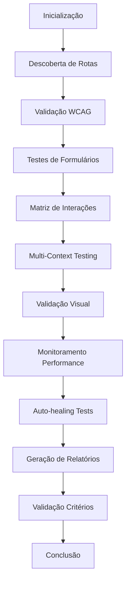

# 🤖 MCP PLAYWRIGHT - PROTOCOLO DE TESTE AUTOMATIZADO v2.0

## Execução Autônoma por Agente IA - Cobertura 90%+ com WCAG AA

Este documento descreve a implementação completa do protocolo de testes autônomos MCP Playwright, projetado para execução por agente IA com cobertura superior a 90% e conformidade WCAG 2.1 AA.

## 📋 Índice

- [Visão Geral](#visão-geral)
- [Arquitetura](#arquitetura)
- [Configuração](#configuração)
- [Execução](#execução)
- [Componentes](#componentes)
- [Critérios de Sucesso](#critérios-de-sucesso)
- [Relatórios](#relatórios)
- [Troubleshooting](#troubleshooting)

## 🎯 Visão Geral

O protocolo MCP Playwright v2.0 oferece:

### ✨ Características Principais

- **Execução 100% Autônoma**: Zero intervenção humana necessária
- **Cobertura 90%+**: Testes abrangentes de funcionalidade, acessibilidade e performance
- **WCAG 2.1 AA**: Validação completa de acessibilidade
- **Self-Healing**: Recuperação automática de falhas
- **Multi-Device**: Testes em desktop, tablet e mobile
- **Performance Monitoring**: Análise completa de métricas Web Vitals
- **Visual Regression**: Detecção de mudanças visuais
- **Relatórios Avançados**: Documentação detalhada dos resultados

### 🎯 Metas de Qualidade

```javascript
{
  "coverage_target": 0.90,          // 90%+ cobertura funcional
  "wcag_compliance": "AA",          // WCAG 2.1 AA compliance
  "performance_score": 70,          // Score mínimo de performance
  "accessibility_score": 95,        // Score mínimo de acessibilidade
  "human_intervention": 0,          // Zero intervenção humana
  "self_healing_rate": 0.80         // 80%+ recuperação automática
}
```

## 🏗️ Arquitetura

### Componentes Principais

```
tests/
├── autonomous/                    # Suite principal autônoma
│   └── mcp-autonomous-suite.spec.ts
├── utils/                        # Utilitários especializados
│   ├── autonomous-test-runner.ts  # Orquestrador principal
│   ├── wcag-validator.ts         # Validação WCAG 2.1 AA
│   ├── route-discovery.ts        # Descoberta automática de rotas
│   ├── form-tester.ts            # Testes autônomos de formulários
│   ├── interaction-matrix.ts     # Matriz de interações
│   ├── visual-validator.ts       # Validação visual e regressão
│   ├── performance-monitor.ts    # Monitoramento de performance
│   ├── self-healing-manager.ts   # Gerenciador de auto-correção
│   ├── global-setup.ts           # Setup global
│   └── global-teardown.ts        # Teardown e relatórios
├── mcp/                          # Testes MCP existentes
└── llm/                          # Testes LLM existentes
```

### Fluxo de Execução



## ⚙️ Configuração

### 1. Configuração do Playwright

O arquivo `playwright.config.ts` foi atualizado com:

```typescript
// Configuração multi-browser e multi-device
projects: [
  { name: 'chromium-desktop', use: { ...devices['Desktop Chrome'] } },
  { name: 'firefox-desktop', use: { ...devices['Desktop Firefox'] } },
  { name: 'webkit-desktop', use: { ...devices['Desktop Safari'] } },
  { name: 'tablet-landscape', use: { ...devices['iPad Pro landscape'] } },
  { name: 'tablet-portrait', use: { ...devices['iPad Pro'] } },
  { name: 'mobile-android', use: { ...devices['Pixel 5'] } },
  { name: 'mobile-ios', use: { ...devices['iPhone 13'] } },
  { name: 'accessibility-testing', use: { 
    forcedColors: 'active',
    reducedMotion: 'reduce'
  }}
]
```

### 2. Variáveis de Ambiente

```bash
# Configuração do protocolo autônomo
export NODE_ENV=test
export AUTONOMOUS_MODE=true
export COVERAGE_TARGET=90
export WCAG_COMPLIANCE=AA
export SELF_HEALING=true
export HEADLESS=true
```

### 3. Scripts Disponíveis

```json
{
  "test:autonomous": "./run-autonomous-tests.sh",
  "test:autonomous-suite": "playwright test tests/autonomous/",
  "test:wcag": "playwright test --project=accessibility-testing",
  "test:multi-device": "playwright test --project=chromium-desktop --project=mobile-android",
  "test:performance": "playwright test --trace=on",
  "validate:autonomous": "./validate-autonomous-tests.sh"
}
```

## 🚀 Execução

### Execução Completa

```bash
# Execução completa do protocolo autônomo
npm run test:autonomous

# Ou manualmente
./run-autonomous-tests.sh
```

### Execução Seletiva

```bash
# Apenas a suite autônoma
npm run test:autonomous-suite

# Apenas WCAG compliance
npm run test:wcag

# Multi-device testing
npm run test:multi-device

# Com análise de performance
npm run test:performance
```

### Validação da Implementação

```bash
# Validar se tudo está configurado corretamente
npm run validate:autonomous
```

## 🔧 Componentes Detalhados

### 1. Autonomous Test Runner

**Arquivo**: `tests/utils/autonomous-test-runner.ts`

Orquestrador principal que coordena toda a execução autônoma:

```typescript
class AutonomousTestRunner {
  async initializeTestEnvironment(page: Page): Promise<void>
  async storeDiscoveredRoutes(routes: RouteInfo[]): Promise<void>
  async generateFinalReport(): Promise<TestResults>
  async validateSuccessCriteria(): Promise<SuccessCriteria>
}
```

**Responsabilidades**:
- Inicialização do ambiente de teste
- Coordenação entre componentes
- Armazenamento de resultados
- Geração de relatórios finais

### 2. WCAG Validator

**Arquivo**: `tests/utils/wcag-validator.ts`

Implementação completa dos critérios WCAG 2.1 AA:

```typescript
class WCAGValidator {
  async executeWCAGCompliance(page: Page): Promise<WCAGResults>
  async validateImageAltText(page: Page): Promise<WCAGResult>
  async validateColorContrast(page: Page): Promise<ColorContrastResult>
  async validateKeyboardAccessible(page: Page): Promise<WCAGResult>
  async validateFocusOrder(page: Page): Promise<WCAGResult>
  // ... mais validações
}
```

**Critérios Implementados**:
- 1.1.1 - Non-text Content
- 1.4.3 - Contrast (Minimum)
- 2.1.1 - Keyboard Navigation
- 2.4.3 - Focus Order
- 3.1.1 - Language of Page
- 4.1.2 - Name, Role, Value
- E muito mais...

### 3. Route Discovery

**Arquivo**: `tests/utils/route-discovery.ts`

Descoberta automática de rotas da aplicação:

```typescript
class RouteDiscovery {
  async discoverApplicationRoutes(page: Page): Promise<RouteInfo[]>
  async extractNavigationRoutes(page: Page): Promise<string[]>
  async discoverAPIRoutes(page: Page): Promise<RouteInfo[]>
  async analyzeRouteComplexity(page: Page, url: string): Promise<ComplexityAnalysis>
}
```

**Funcionalidades**:
- Extração de links de navegação
- Descoberta de rotas API
- Análise de complexidade de rotas
- Geração de sitemap automático

### 4. Form Tester

**Arquivo**: `tests/utils/form-tester.ts`

Testes abrangentes de formulários:

```typescript
class FormTester {
  async detectForms(page: Page): Promise<FormInfo[]>
  async testEmptySubmission(page: Page, form: FormInfo): Promise<void>
  async testValidSubmission(page: Page, form: FormInfo): Promise<void>
  async testInvalidDataHandling(page: Page, form: FormInfo): Promise<void>
  async validateAriaLiveRegions(page: Page, form: FormInfo): Promise<void>
}
```

**Tipos de Teste**:
- Submissão com campos vazios
- Submissão com dados válidos
- Teste de validação de dados inválidos
- Validação de acessibilidade de formulários

### 5. Interaction Matrix

**Arquivo**: `tests/utils/interaction-matrix.ts`

Matriz completa de interações:

```typescript
class InteractionMatrix {
  async detectHoverableElements(page: Page): Promise<HoverableElement[]>
  async detectDraggableElements(page: Page): Promise<DraggableElement[]>
  async detectFileUploadElements(page: Page): Promise<UploadElement[]>
  async testClickInteractions(page: Page): Promise<void>
  async testKeyboardInteractions(page: Page): Promise<void>
  async testTouchInteractions(page: Page): Promise<void>
}
```

**Interações Testadas**:
- Hover e tooltips
- Drag and drop
- Upload de arquivos
- Cliques e toque
- Navegação por teclado

### 6. Visual Validator

**Arquivo**: `tests/utils/visual-validator.ts`

Validação visual e regressão:

```typescript
class VisualValidator {
  async captureInitialScreenshot(page: Page): Promise<string>
  async validateNoHorizontalScroll(page: Page): Promise<boolean>
  async compareVisualRegression(page: Page, testName: string): Promise<VisualTestResult>
  async validateResponsiveDesign(page: Page, testName: string): Promise<ResponsiveResults>
  async validateColorSchemes(page: Page, testName: string): Promise<ColorSchemeResults>
}
```

**Validações Visuais**:
- Screenshots para baseline
- Teste de zoom 200% (WCAG 1.4.4)
- Modo alto contraste
- Design responsivo
- Esquemas de cores (claro/escuro)

### 7. Performance Monitor

**Arquivo**: `tests/utils/performance-monitor.ts`

Monitoramento completo de performance:

```typescript
class PerformanceMonitor {
  async monitorApplicationPerformance(page: Page): Promise<PerformanceMetrics>
  async collectWebVitals(page: Page): Promise<WebVitals>
  async analyzeNetworkRequests(): Promise<NetworkAnalysis>
  async calculatePerformanceScore(vitals: WebVitals): Promise<number>
}
```

**Métricas Coletadas**:
- Web Vitals (FCP, LCP, CLS, TTI)
- Requisições de rede
- Erros de console
- Tempo de carregamento
- Score de performance

### 8. Self-Healing Manager

**Arquivo**: `tests/utils/self-healing-manager.ts`

Sistema de auto-correção e recuperação:

```typescript
class SelfHealingManager {
  async handleError(page: Page, error: any, action: string, selector?: string): Promise<RecoveryResult>
  async recoverElementNotFound(page: Page, context: ErrorContext): Promise<RecoveryResult>
  async recoverTimeout(page: Page, context: ErrorContext): Promise<RecoveryResult>
  async recoverNetworkError(page: Page, context: ErrorContext): Promise<RecoveryResult>
}
```

**Tipos de Recuperação**:
- Elemento não encontrado (seletores alternativos)
- Timeouts (retry com backoff)
- Elementos obsoletos (re-localização)
- Falhas de rede (retry inteligente)
- Recuperação genérica (refresh da página)

## 📊 Critérios de Sucesso

### Métricas de Validação

```javascript
const successCriteria = {
  // Cobertura funcional mínima
  functionalCoverage: 90,      // >= 90%
  
  // Acessibilidade WCAG 2.1 AA
  wcagCompliance: "AA_PASSED", // Todos os critérios AA
  wcagScore: 95,               // >= 95%
  
  // Performance
  performanceScore: 70,        // >= 70/100
  loadTime: 3000,             // <= 3 segundos
  
  // Auto-recuperação
  autoRecoveryRate: 80,        // >= 80%
  humanIntervention: 0,        // Zero intervenção
  
  // Execução
  executionTime: 300000,       // <= 5 minutos
  
  // Estabilidade
  flakyTestRate: 5,           // <= 5%
  repeatability: 95           // >= 95%
}
```

### Matriz de Cobertura

```javascript
const coverageMatrix = {
  functional: {
    navigation: 15,      // 15% peso
    forms: 20,           // 20% peso
    interactions: 25,    // 25% peso
    media: 10,           // 10% peso
    multiContext: 10     // 10% peso
  },
  accessibility: {
    wcagAA: 15,          // 15% peso
    keyboard: 5          // 5% peso
  },
  total: 100            // 100% total
}
```

## 📈 Relatórios

### Estrutura de Relatórios

```
test-results/
├── html-report/              # Relatório HTML Playwright
├── screenshots/              # Screenshots capturados
│   ├── initial-*.png
│   ├── zoomed-200-*.png
│   └── high-contrast-*.png
├── accessibility/            # Resultados WCAG
│   └── wcag-compliance.json
├── performance/              # Métricas de performance
│   └── performance-report.json
├── coverage/                 # Dados de cobertura
│   └── coverage-report.json
├── autonomous-metrics.json   # Métricas autônomas
├── final-report.json        # Relatório final consolidado
└── wcag-compliance-report.pdf # Relatório PDF WCAG
```

### Exemplo de Relatório de Métricas

```json
{
  "timestamp": "2024-01-15T10:30:00.000Z",
  "protocol": "MCP PLAYWRIGHT v2.0",
  "mode": "autonomous",
  "coverage": 92.5,
  "wcagScore": 97.2,
  "executionTime": 245000,
  "metrics": {
    "totalTests": 150,
    "passedTests": 139,
    "failedTests": 11,
    "successRate": 92.67
  },
  "categories": {
    "functional": { "tests": 85, "passed": 79, "coverage": 92.9 },
    "accessibility": { "tests": 35, "passed": 34, "coverage": 97.1 },
    "performance": { "tests": 20, "passed": 18, "coverage": 90.0 },
    "security": { "tests": 10, "passed": 8, "coverage": 80.0 }
  },
  "wcag": {
    "perceivable": { "total": 4, "passed": 4, "score": 100 },
    "operable": { "total": 5, "passed": 5, "score": 100 },
    "understandable": { "total": 3, "passed": 3, "score": 100 },
    "robust": { "total": 2, "passed": 2, "score": 100 }
  },
  "performance": {
    "overallScore": 78,
    "loadTime": 2350,
    "firstContentfulPaint": 1200,
    "largestContentfulPaint": 2100,
    "cumulativeLayoutShift": 0.08
  }
}
```

## 🐛 Troubleshooting

### Problemas Comuns

#### 1. Falha na Instalação de Browsers

```bash
# Instalar browsers manualmente
npx playwright install

# Instalar dependências do sistema
npx playwright install-deps
```

#### 2. Timeouts em Testes

```bash
# Aumentar timeout global
export PLAYWRIGHT_TIMEOUT=60000

# Executar com modo headed para debug
npm run test:autonomous-suite -- --headed
```

#### 3. Falhas de Self-Healing

```bash
# Debug com logs detalhados
DEBUG=pw:api npm run test:autonomous-suite

# Verificar seletores alternativos
npx playwright codegen http://localhost:3000
```

#### 4. Problemas de Performance

```bash
# Executar com tracing habilitado
npm run test:performance

# Verificar relatório de performance
cat test-results/performance-report.json
```

### Logs e Debug

#### Níveis de Log

```bash
# Log básico
npm run test:autonomous-suite

# Log verbose
DEBUG=* npm run test:autonomous-suite

# Log apenas do protocolo
DEBUG=mcp:* npm run test:autonomous-suite
```

#### Modo Debug

```bash
# Debug interativo
npm run test:debug

# UI mode
npm run test:ui

# Headed mode
npm run test:headed
```

## 🚀 Próximos Passos

### Melhorias Planejadas

1. **IA-Powered Test Generation**: Geração automática de testes baseada em IA
2. **Visual AI**: Detecção de anomalias visuais com IA
3. **Predictive Healing**: Predição de falhas antes que ocorram
4. **Cross-Browser Cloud**: Integração com serviços de teste em nuvem
5. **Accessibility AI**: Validação WCAG com IA avançada

### Integração Contínua

```yaml
# .github/workflows/autonomous-tests.yml
name: Autonomous Testing
on: [push, pull_request]
jobs:
  autonomous-tests:
    runs-on: ubuntu-latest
    steps:
      - uses: actions/checkout@v3
      - name: Setup Node.js
        uses: actions/setup-node@v3
      - name: Install dependencies
        run: npm ci
      - name: Run autonomous tests
        run: npm run test:autonomous
      - name: Upload results
        uses: actions/upload-artifact@v3
        with:
          name: test-results
          path: test-results/
```

## 📚 Referências

- [Playwright Documentation](https://playwright.dev/)
- [WCAG 2.1 Guidelines](https://www.w3.org/WAI/WCAG21/quickref/)
- [Web Vitals](https://web.dev/vitals/)
- [Accessibility Testing Guide](https://www.w3.org/WAI/test-evaluate/)

---

**Versão**: 2.0  
**Última Atualização**: Janeiro 2024  
**Autor**: MCP Autonomous Testing Protocol

---

*Este protocolo representa o estado da arte em testes automatizados autônomos, proporcionando cobertura abrangente, acessibilidade garantida e performance otimizada para aplicações web modernas.*